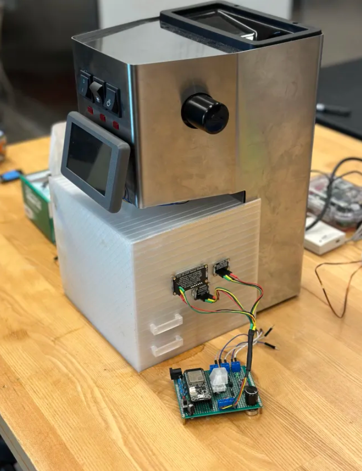
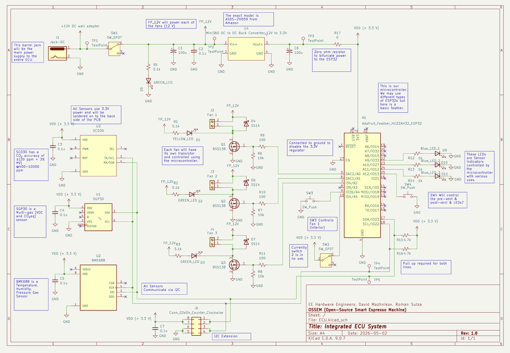
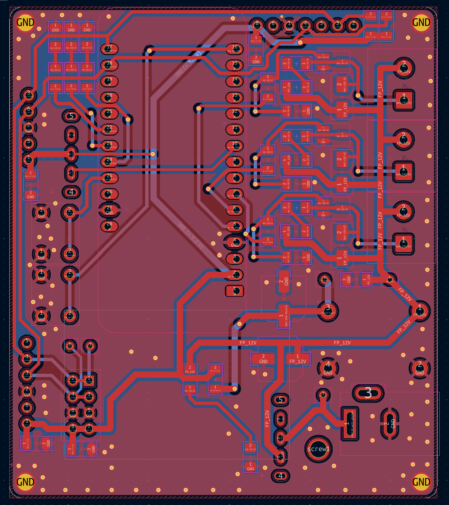
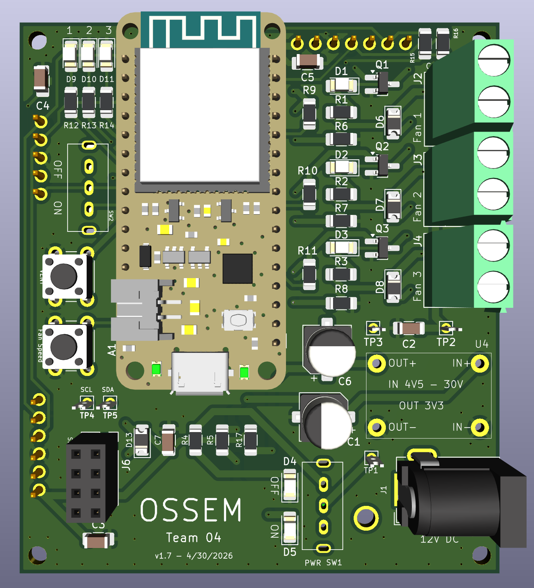
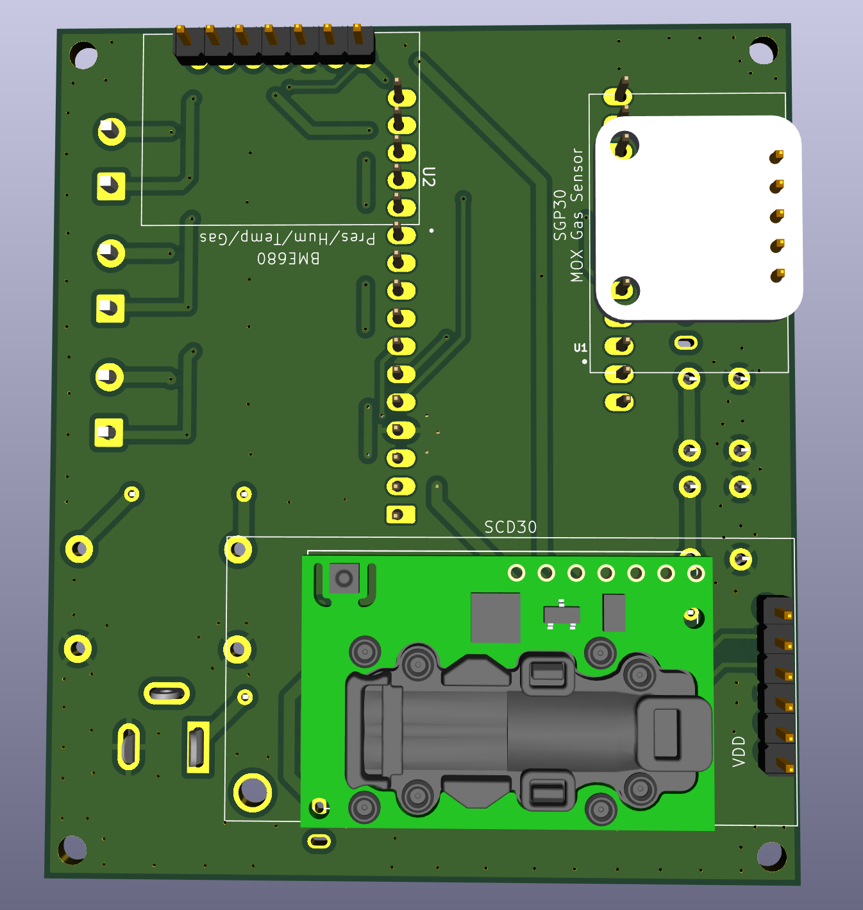
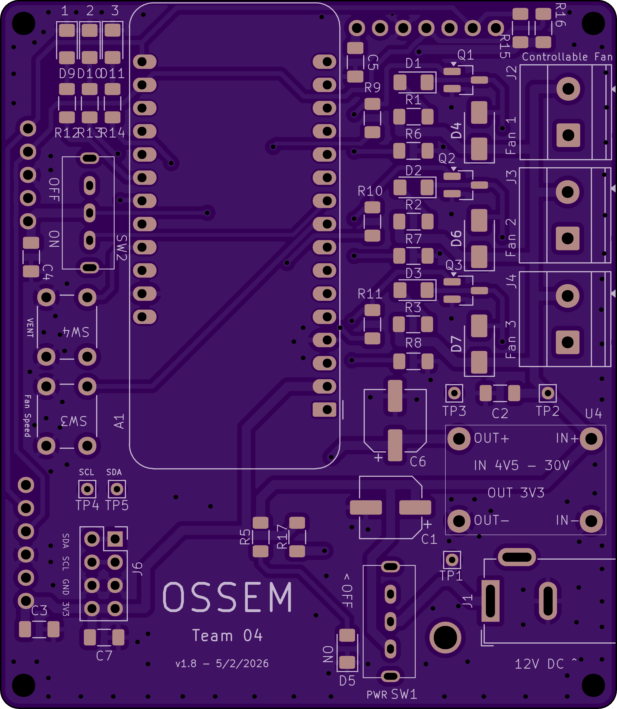
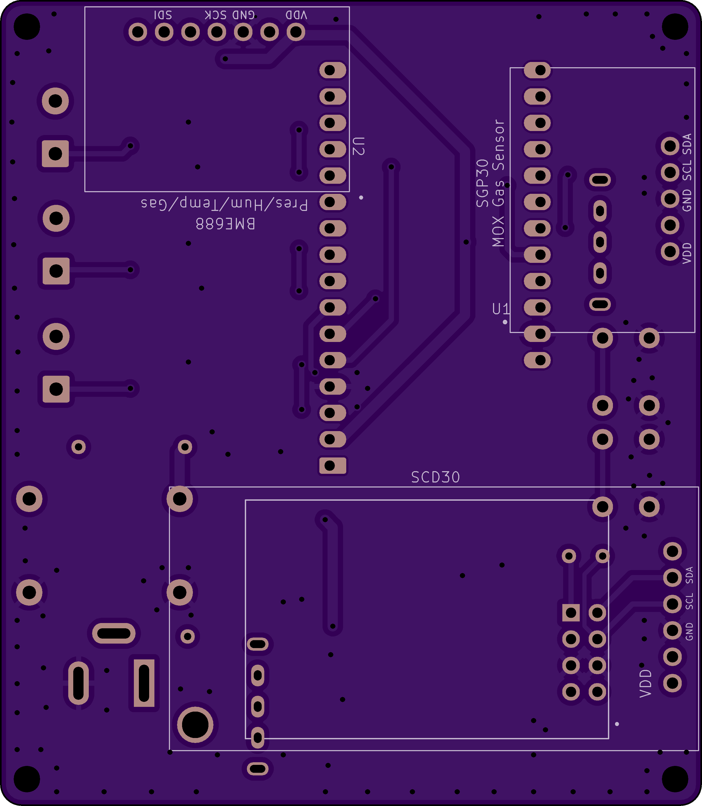
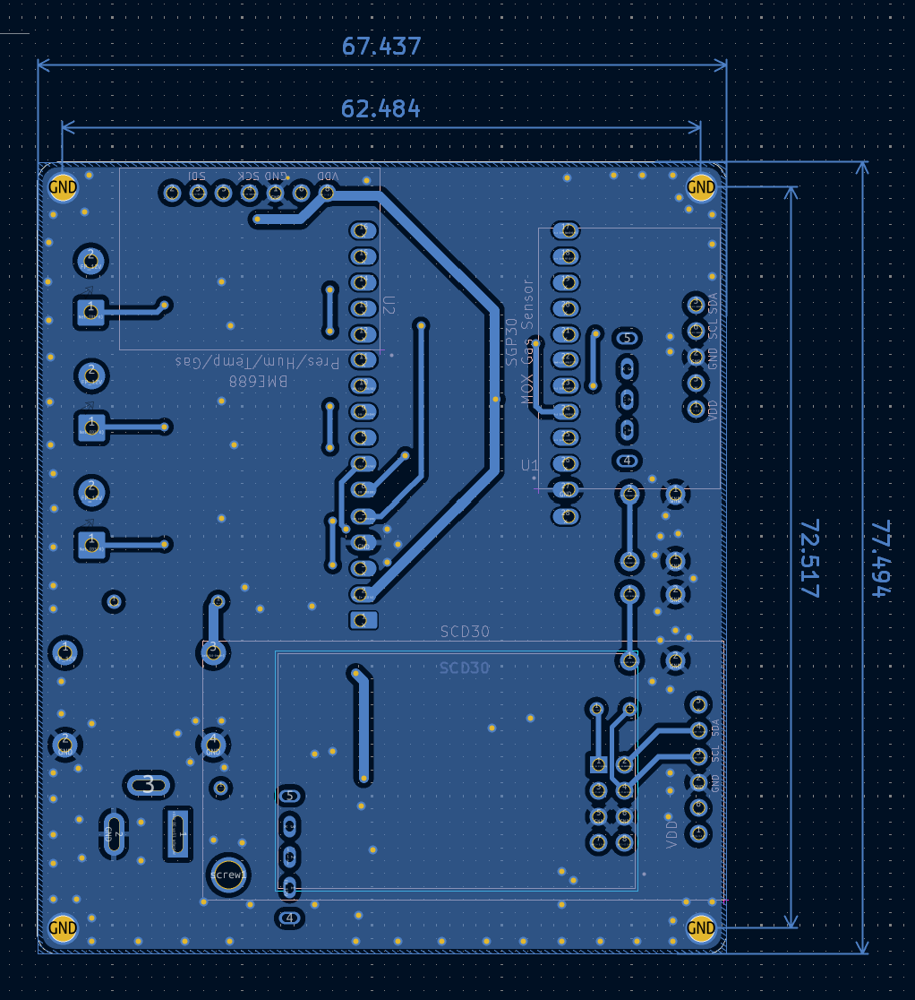
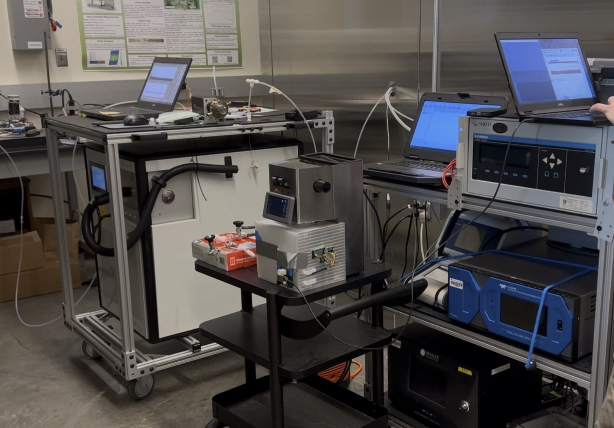

# OSSEM
OSSEM organization repo

Espresso brewing is a thermo-fluid process where temperature, pressure, flow rate, and time directly effect extraction and flavor. Commercial smart espresso machines offer advanced control, but are expensive, closed-source, and difficult to adapt for experimental research. Existing open-source modifications improve accessibility but do not fully support research-grade measurement or instrumentation. 

This project focuses on building an open-source smart espresso machine based on the Gaggia Classic Pro, using platforms such as Gaggiuino and Gaggia Mate for embedded control and data logging. The system will allow precise control of brewing parameters, including temperature, pressure, flow profiling, and shot timing. 

Working with the Healthy Buildings Research Lab and the Coffee Telesensing Lab at Portland State University, the machine will be adapted to support PTR-MS and UV-VIS spectroscopy for measuring volatile organic compounds (VOCs) released during espresso extraction. The result will be a flexible, open source platform that supports repeatable espresso brewing and controlled emissions research.

  

  <em>Smart Espresso Machine – Emissions Control Unit (ECU)</em>

  

  <em>Smart Espresso Machine – Schematic v1.8</em>

  

  <em>Smart Espresso Machine – PCB v1.8 </em>

  

  <em>Smart Espresso Machine – 3D PCB v1.8 Front</em>

  

  <em>Smart Espresso Machine – 3D PCB v1.8 Back</em>

  

  <em>Smart Espresso Machine – PCB v1.8 front</em>

  

  <em>Smart Espresso Machine – PCB v1.8 back</em>

  

  <em>Smart Espresso Machine – PCB v1.8 back with dimensions</em>

  

  <em>PTR-MS Testing in the Healthy Buildings Research Lab</em>

